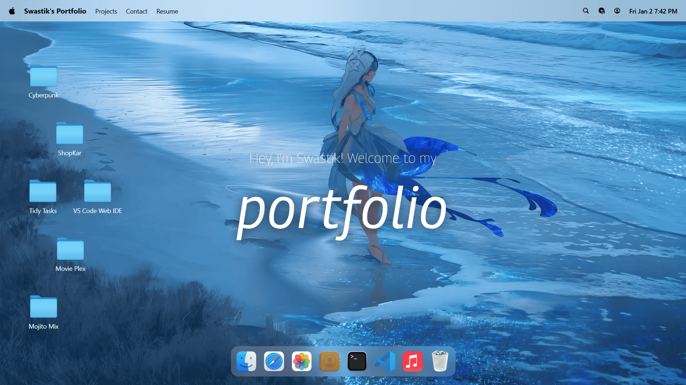
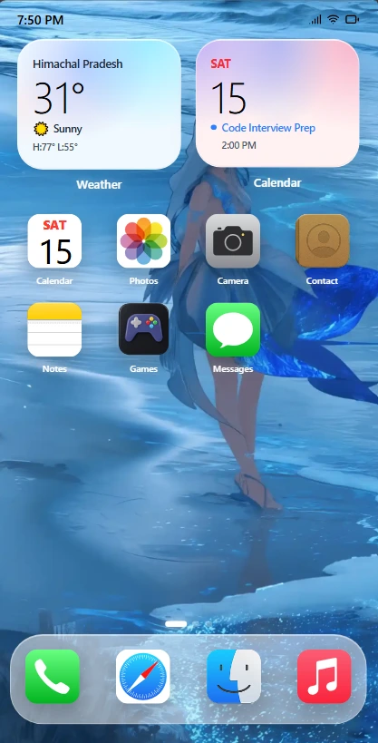

# Portfolio-macOS

A sleek, macOS-inspired portfolio website.

## Previews

### macOS Desktop View


### iOS Mobile View


## Project Versions

This repository contains two implementations of the portfolio:

1. **Next.js & TypeScript**
   Located in the `Macos-in-NextJS-with-TS` folder. This is the modern, strongly-typed version using Next.js.
   
2. **React & JavaScript**
   Located in the `Macos-in-React-with-JS` folder. This is the standard React version using JavaScript.

## Getting Started

To run either version locally, navigate to the respective directory, install dependencies, and start the development server:

```bash
# Example for Next.js version
cd Macos-in-NextJS-with-TS
npm install
npm run dev
```
